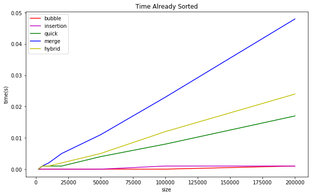
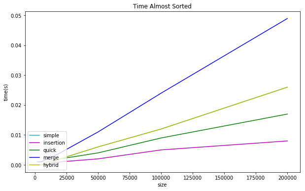
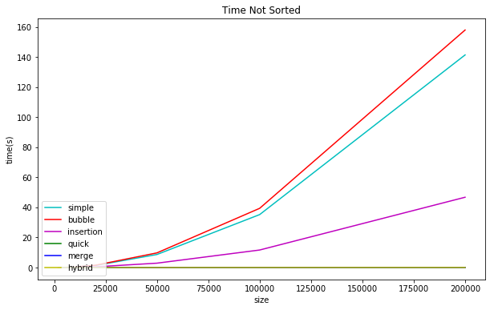

#####Sorting algorithms

All the sorting algorithms were run on Ulysses cluster. Everything has been tested on three different cases: unsorted, sorted and mostly sorted data. The sizes of the array were: 2000, 5000, 10000, 20000, 50000, 100000, 200000.

Here some benchmarks of the different sorting algorithms implemented. The analisys have been made on three different cases (unsorted, sorted and mostly sorted) for the following arrays sizes: 500,1000,2000,5000,10000,50000,100000,200000.

In fig.1 the simple sorting is not reported since too slow compared with respect to the others.

In fig.2 the bubble sorting is not reported since too slow compared with respect to the others.

####Perf analisys

`perf` analysis on the Ulysses cluster for each sorting algorithm

-------| Simple | Bubble | Insertion | Quick |  Merge | Hybrid
-------|--------|--------|-----------|-------------|-------------|--------|
cache-ref |216.915.843 | 232.200.271 | 43.890.327  | 132.746  | 320.026 |
cache-miss |280.695 |  465.161 | 51.589 |10.515 | 16560 | 15.981 |
instructions| 1.458.593.235.858| 1.492.033.489.477 | 384.957.224.870 | 765.441.350 | 2.201.084.237 | 1.206.282.179 |
cycles |775.465.448.666| 865.297.915.514 | 185.583.127.312 | 424.181.763 | 957.791.410 | 580.446.242 |
branches |159.305.160.013| 158.097.243.838 | 39.852.451.015 | 73.204.982 | 270.160.686 | 114.767.427 |

####Conclusions

The general behaviour is that the slowest cases are the simple, bubble and insertion sorting approaches (in theory $O(N^2)$). However, the latter has higer performances with respect to the formers.

#####Data Structure

Timing for the array:
"""
Performing    5000  array value lookups took:    1.682000 ms
Performing    5000  array value lookups took:    0.372000 ms
Performing    5000  array value lookups took:    0.924000 ms
Performing    5000  array value lookups took:    1.697000 ms
Performing    5000  array value lookups took:    0.650000 ms
Performing    5000  array value lookups took:    0.664000 ms
"""

Timing for the linked list:

Performing    5000  linked list lookups took:    3.428000 ms
Performing    5000  linked list lookups took:    0.761000 ms
Performing    5000  linked list lookups took:    1.844000 ms
Performing    5000  linked list lookups took:    4.267000 ms
Performing    5000  linked list lookups took:    1.370000 ms
Performing    5000  linked list lookups took:    1.367000 ms

Timing for the hash table (num_buckets = 150):

Performing    5000   hash table lookups took:    0.170000 ms
Performing    5000   hash table lookups took:    0.072000 ms
Performing    5000   hash table lookups took:    0.123000 ms
Performing    5000   hash table lookups took:    0.160000 ms
Performing    5000   hash table lookups took:    0.146000 ms
Performing    5000   hash table lookups took:    0.132000 ms

Timing for the binary tree:

 Performing    5000  Binary Tree lookups took:    8.868000 ms
 Performing    5000  Binary Tree lookups took:    1.855000 ms
 Performing    5000  Binary Tree lookups took:    3.837001 ms
 Performing    5000  Binary Tree lookups took:    8.723001 ms
 Performing    5000  Binary Tree lookups took:    0.323000 ms
 Performing    5000  Binary Tree lookups took:    0.414000 ms

Timing for the rebalanced binary tree:

Performing    5000 Rebalanced Tree look took:    0.370000 ms
Performing    5000 Rebalanced Tree look took:    0.302000 ms
Performing    5000 Rebalanced Tree look took:    0.318000 ms
Performing    5000 Rebalanced Tree look took:    0.506001 ms
Performing    5000 Rebalanced Tree look took:    0.347000 ms
Performing    5000 Rebalanced Tree look took:    0.394000 ms
