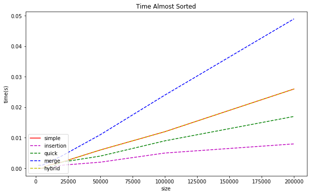

#####Perf analisys

`perf` analysis on the Ulysses cluster for each sorting algorithm 

-------| Simple | Bubble | Insertion | Quick |  Merge | Hybrid
-------|--------|--------|-----------|-------------|-------------|--------|
cache-ref |216.915.843 | 232.200.271 | 43.890.327  | 132.746  | 320.026 | 
cache-miss |280.695 |  465.161 | 51.589 |10.515 | 16560 | 15.981 | 
instructions| 1.458.593.235.858| 1.492.033.489.477 | 384.957.224.870 | 765.441.350 | 2.201.084.237 | 1.206.282.179 | 
cycles |775.465.448.666| 865.297.915.514 | 185.583.127.312 | 424.181.763 | 957.791.410 | 580.446.242 |
branches |159.305.160.013| 158.097.243.838 | 39.852.451.015 | 73.204.982 | 270.160.686 | 114.767.427 |
